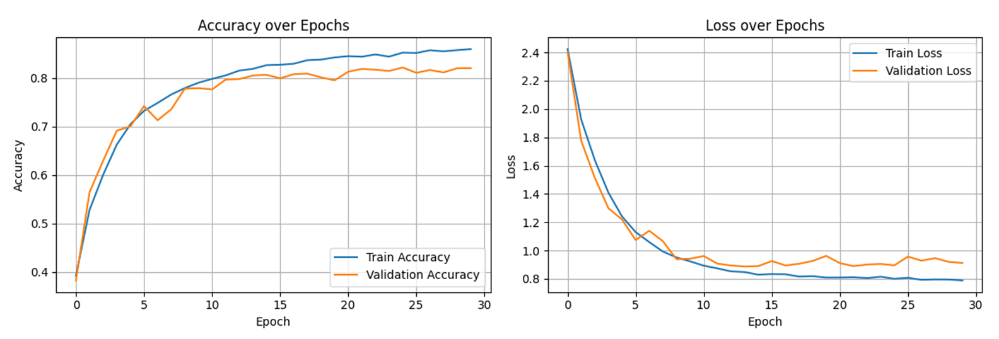

# CIFAR-10 Image Classification with CNN


## 🎯 Project Description
This project implements a Convolutional Neural Network (CNN) for classifying images from the CIFAR-10 dataset, following specific architectural constraints and optimization requirements.

## 👥 Team Members 
- Rene Dvash 
- Tagreed Assi

## ✨ Key Features
- Custom CNN architecture with constraints based on ID digits
- Experimentation with:
  - Different activation functions (ReLU, ELU, etc.)
  - Regularization techniques (L1/L2, Dropout, BatchNorm)
  - Weight initialization methods
  - Various optimizers (SGD, Adam, RMSprop, etc.)
- Comprehensive overfitting prevention strategies

## 🔐 Architecture Constraints
- Filter/neuron counts based on ID digits (2-digit combinations):
  - Valid sizes: 21, 13, 34, 46, 68, 82, 20, 32, 23, 28, 89, 95
- Used layer sizes in model:
  - Conv2D: 32, 68, 82
  - Dense: 89

## 📊 Results & Visualization

### Training Performance Analysis
 

**Key Observations from Graphs**:
1. **Accuracy Progression**:
   - Training accuracy reaches 90.7%
   - Validation accuracy peaks at 82%

2. **Loss Reduction**:
   - Training loss drops to 0.647
   - Validation loss stabilizes at 0.911
   - Effective regularization shown by small train-val gap

### 🔄 Detailed Optimizer Comparison
For complete experimental documentation including:
- Learning rate tests
- Batch size variations
- Epoch-by-epoch metrics
- Additional visualizations
👉 [View Full Experimental Report](hyperparameters_ex1.pdf)

## Optimizer Performance Comparison

| Optimizer           | Configuration          | Test Accuracy | Test Loss | Val Accuracy | Val Loss | Train Accuracy | Train Loss | Training Stability |
|---------------------|------------------------|---------------|-----------|--------------|----------|----------------|------------|--------------------|
| **SGD**            | Vanilla                | 81.8%         | 0.828     | 82.2%        | 0.810    | 94.2%          | 0.456      | Medium             |
| **SGD+Momentum**   | μ=0.95                 | 82.0%         | 0.909     | 82.0%        | 0.911    | 90.7%          | 0.647      | High               |
| **SGD+Nesterov**   | μ=0.9, nesterov=True   | 81.7%         | 0.879     | 81.6%        | 0.868    | 85.8%          | 0.751      | High               |
| **Adagrad**        | lr=0.1                 | 79.9%         | 0.799     | 80.8%        | 0.770    | 88.8%          | 0.533      | Medium             |
| **Adadelta**       | lr=0.01                | 81.4%         | 0.599     | 81.9%        | 0.574    | 94.3%          | 0.176      | Low                |
| **RMSprop**        | Default                | 81.3%         | 0.989     | 81.9%        | 0.961    | 91.0%          | 0.698      | Medium             |
| **Adam**           | Default                | 80.2%         | 0.966     | 80.2%        | 0.963    | 86.5%          | 0.762      | Medium             |

### 🔍 Key Observations:
1. **Top Performers**:
   - SGD with Momentum (μ=0.95) achieved highest test accuracy (82.0%)
   - Vanilla SGD showed best validation accuracy (82.2%) 
   - Adadelta demonstrated lowest losses but potential overfitting (train acc: 94.3%)

2. **Training Dynamics**:
   - Momentum-based SGD variants showed most stable training
   - Adadelta had largest train-test gap (Δ12.9% accuracy)
   - Adam underperformed compared to SGD variants

3. **Recommendation**:
   ```python
   # Best performing configuration
   optimizer = keras.optimizers.SGD(
       learning_rate=0.01,
       momentum=0.95
   )

## 🧠 Model Architecture
```python
layers.BatchNormalization(),
layers.Conv2D(32, (3, 3), padding='same', activation='relu',kernel_regularizer=regularizers.l2(0.001)),
layers.BatchNormalization(),
layers.Conv2D(32, (3, 3), padding='same', activation='relu',kernel_regularizer=regularizers.l2(0.001)),
layers.BatchNormalization(),
layers.MaxPooling2D((2, 2)),
layers.Dropout(0.15),

layers.Conv2D(68, (3, 3), padding='same', activation='relu',kernel_regularizer=regularizers.l2(0.001)),
layers.BatchNormalization(),
layers.Conv2D(68, (3, 3), padding='same', activation='relu',kernel_regularizer=regularizers.l2(0.001)),
layers.BatchNormalization(),
layers.MaxPooling2D((2, 2)),
layers.Dropout(0.2),

layers.Conv2D(82, (3, 3), padding='same', activation='relu',kernel_regularizer=regularizers.l2(0.001)),
layers.BatchNormalization(),
layers.Conv2D(82, (3, 3), padding='same', activation='relu',kernel_regularizer=regularizers.l2(0.001)),
layers.BatchNormalization(),
layers.MaxPooling2D((2, 2)),
layers.Dropout(0.3),

layers.Flatten(),
layers.Dense(95, activation='relu',kernel_regularizer=regularizers.l2(0.001)),
layers.BatchNormalization(),
layers.Dense(89, activation='relu',kernel_regularizer=regularizers.l2(0.001)),
layers.BatchNormalization(),
layers.Dropout(0.4),
layers.Dense(num_classes, activation='softmax'),
```
